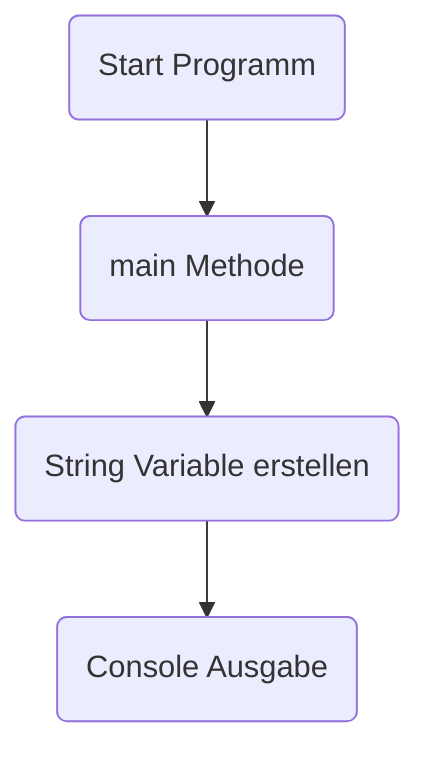
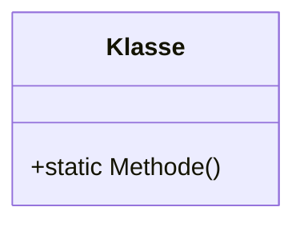
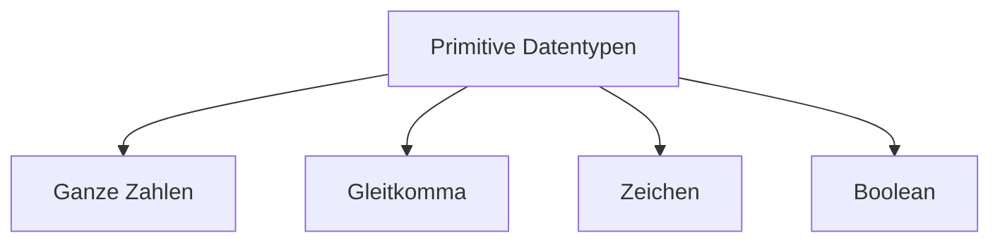
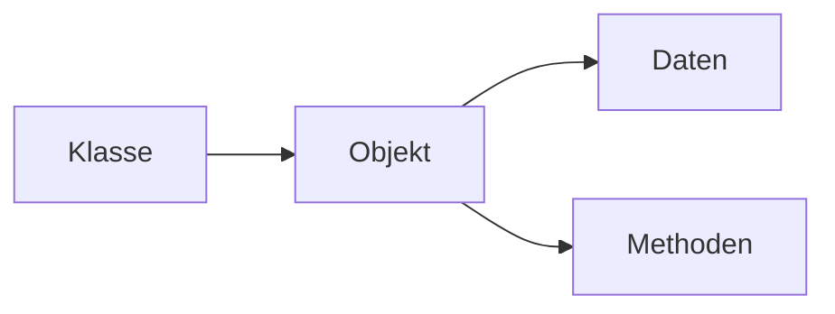
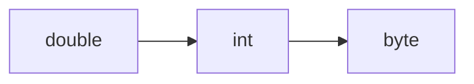

# 📘 Java Grundlagen – Lernübersicht

---

## 🧭 Navigation

[](#-hello-world)
[](#-static-methods)
[](#-primitive-datentypen)
[](#-datenobjekte--scope)
[](#-type-casting)
[](#-strings)
[](#-operatoren)
[](#-prüfungsrelevant)

---

# 💻 Hello World

👉 Demo Datei: `D01_HelloWorld.java`

---

## 📖 Programmablauf



---

<details open>
<summary><b>Code Beispiel</b></summary>

```java
public class D01_HelloWorld {

    public static void main(String[] args) {

        String text = "Hello World";
        System.out.println(text);
    }
}
```

</details>

---

### 📌 Merken

- `main()` ist Einstiegspunkt  
- `void` bedeutet kein Rückgabewert  
- Klassennamen beginnen mit Großbuchstaben  

---

# ⚙ Static Methods

👉 Demo Datei: `D02_StaticMethods.java`

---

## 📖 Erklärung

Static Methoden gehören zur Klasse und nicht zu einem Objekt.

---



---

<details>
<summary><b>Code Beispiel</b></summary>

```java
public static void hallo() {
    System.out.println("Hallo");
}
```

</details>

---

### 📌 Merken

- Zugriff ohne Objekt  
- Wird über Klassenname aufgerufen  

---

# 🔢 Primitive Datentypen

👉 Demo Datei: `D03_PrimitiveDataTypes.java`

---

## 📖 Übersicht



---

<details open>
<summary><b>Datentyp Tabelle</b></summary>

### Ganze Zahlen

| Datentyp | Größe |
|-----------|------------|
| byte | 1 Byte |
| short | 2 Byte |
| int | 4 Byte |
| long | 8 Byte |

---

### Gleitkommazahlen

| Datentyp | Größe |
|-----------|------------|
| float | 4 Byte |
| double | 8 Byte |

---

### Zeichen

```java
char buchstabe = 'A';
```

---

### Wahrheitswerte

```java
boolean status = true;
```

</details>

---

### 📌 Regeln

- Primitive Datentypen speichern genau einen Wert  
- Java ist stark typisiert  
- Variablen müssen initialisiert werden  

---

# 📦 Datenobjekte & Scope

👉 Demo Datei: `D04_DataObjects.java`

---



---

<details>
<summary><b>Grundlagen</b></summary>

### Datenobjekt  
Container zum Speichern von Daten.

---

### Scope  
Bestimmt die Sichtbarkeit von Variablen.  
Variablen sind nur innerhalb ihres Blocks sichtbar.

</details>

---

# 🔄 Type Casting

👉 Demo Datei: `D05_TypeCasting.java`

---

## 📖 Datentyp Umwandlung



---

<details>
<summary><b>Beispiel</b></summary>

```java
double d = 1.9;
int i = (int) d;
```

</details>

---

### ⚠ Wertverlust

Beim Umwandeln können Dezimalstellen verloren gehen.  
➡ Ergebnis = 1  

---

### 📌 Begriffe

**Implizite Umwandlung**  
→ Automatisch  

**Explizites Casting**  
→ Muss programmiert werden  

---

# 🧵 Strings

👉 Demo Datei: `D06_Strings.java`

---

<details>
<summary><b>Grundlagen</b></summary>

Strings speichern Text.

```java
String text = "Hallo Welt";
```

</details>

---

### 📌 Eigenschaften

- Strings sind Objekte  
- Verkettung mit `+` möglich  

---

# ➕ Operatoren

👉 Demo Datei: `D07_ArithmeticOperators.java`

---

<details>
<summary><b>Operator Übersicht</b></summary>

| Operator | Bedeutung |
|-------------|----------------|
| + | Addition |
| - | Subtraktion |
| * | Multiplikation |
| / | Division |
| % | Modulo |

---

```java
int a = 10;
int b = 3;

int sum = a + b;
int rest = a % b;
```

</details>

---

# 🚨 Prüfungsrelevant

<details>
<summary><b>Merken</b></summary>

✅ Primitive Datentypen  
✅ Static Methoden  
✅ Aufbau einer Java Klasse  
✅ main Methode  
✅ Type Casting  
✅ Scope  

</details>

---

# 📚 Gesamt Zusammenfassung

- Java ist objektorientiert  
- Java ist stark typisiert  
- Programme starten in `main()`  
- Primitive Datentypen speichern einzelne Werte  
- Static Methoden gehören zur Klasse  
- Casting verändert Datentypen  
- Strings speichern Text  
- Operatoren führen Berechnungen aus  

---

# 🎯 Lernstrategie

1. Demo Code lesen  
2. README durcharbeiten  
3. Code verändern  
4. Übungen schreiben  
5. Wiederholen  

---
